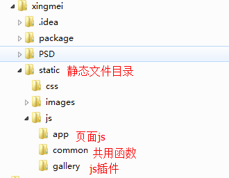

#前端架构（旧文档）
---

##前端结构目录

**涉及框架**

+ HTML5 BOILERPLATE
+ requriejs
+ jquery

##HTML5 BOILERPLATE

    <!--[if lt IE 7]>  <html class="no-js lt-ie9 lt-ie8 lt-ie7"> <![endif]-->
    <!--[if IE 7]> <html class="no-js lt-ie9 lt-ie8"> <![endif]-->
    <!--[if IE 8]> <html class="no-js lt-ie9"> <![endif]-->
    <!--[if gt IE 8]><!--> <html class="no-js" lang="zh-CN"> <!--<![endif]-->

针对`ie`分别有全局的类名来区别，方便我们对各`ie`版本进行`hack`，不需再`css`文件中写`hack`语法。

*ie8与ie9+有些hack不能区分*

比如：
	
	/* 支持 rgba */
	.header-content{
	    height: 88px;
	    background: rgba(0, 0, 0, .7);
	}
	
	/* 不支持rgba, ie8- */
	.lt-ie8 .header-content{
	    -ms-filter: progid:DXImageTransform.Microsoft.gradient(startColorstr=#77000000, endColorstr=#77000000);
	    filter: progid:DXImageTransform.Microsoft.gradient(startColorstr=#77000000, endColorstr=#77000000);
	}

##requirejs

`requirejs`是一个遵循`AMD`模块化管理框架。

`jquery`本身是支持`AMD`规范的库。

**模块定义**

`define`是定义模块的关键字，只要引入`require.js`，它就会做为全局变量对象存在。
	
	// mod.js
	define(['jquery'], function($){
		/*---------------
		// 方法1
		/*var dialog = {
			init: function(){},
			show: function(){}
		};
	
		// 返回 export
		return dialog;
		----------*/
	
		/*---------------
		// 方法2
		return {
			init: function(){},
			show: function(){}
		}
		----------*/
	
		// 方法3
		return function(arg1, arg2, arg3){
			// code
		}
	});
	

**模块使用**

`require`是使用模块立即调用函数。它可以加载其他模块，若页面已有该模块不重复引用， 提供了类似于`jquery()`一个闭包的良好环境。
	
	// 依赖jquery,mode模块
	require(['jquery', 'mod'], function($, mod){
		$("#demo").on("click", $.proxy(mod.show, mod));
	});

模块化优化
---
前端静态文件http请求优化，需我们先引入js文件。

模块化定义使用`AMD`规范，通过id来定义模块，从先引入的js文件中我们可以根据id使用该模块而不需要重新异步加载改文件

	define(id,[deps], fn);

或者

	define(id,function(require,exports,module){});

**例子**
	
	// iscroll.js
	define('gallery/iscroll', function(require){
		var $ = require('jquery');
		var iScroll = require('iscroll');
	});

	//app.js
	define('app', function(require){
		var $ = require('jquery');
		var iscroll = require('gallery/iscroll');  // 'gallery/iscroll'模块id 不建议使用require.config来重新配置
	});

i.php combo用法
---

`type` 定义引入类型，决定是`link`标签还是`script`方式

`href` 定义css或js文件路径，通过`,`分段处理各文件,每个类数组方式`[dir/a.css,b.css]`定义一个目录下的静态文件 

`v` 作为版本号

	/i.php?type=css&href=[/tpl/assert/css/main.css],<{$cssArr}>&v=20140612