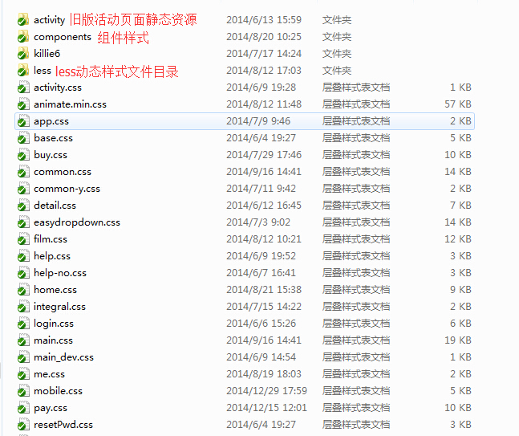
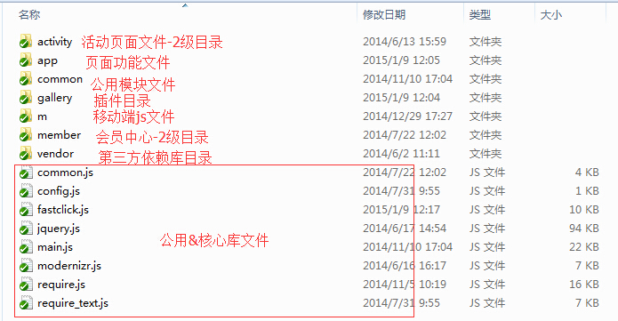

#目录结构

* css
* js
* images

## 图片

直接存放`images`目录或在该目录下再添加一级，主要按功能模块来命名

## css样式

`css`目录直接存放个页面应用的css文件及公用文件。

`components`目录主要存放评论，电影列表，选座等组件样式

> less目录为动态css文件目录，暂时用的地方不多，只在某活动页面使用过

## javascript

`activity` 主要存放旧活动页面的js文件

`app` 主要存放模块js文件，比如购票，用户登录等。

`common`存放公用功能文件，比如browser.js浏览器版本判断，cookie.js等等。

> `m`主要存放html5的js文件

