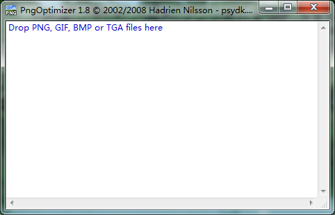

# 图片处理优化

图片优先以`png8`作为首选格式

`jpg`格式以最低质量`60%`来保存，具体自己调整，尽量控制在`100KB`范围左右,按实际情况可勾选PS中`连续`选项。

小图可以考虑合并sprite图片，减少http请求数，但注意图标之间的间隙。

半透明图片使用`png32`保存，不考虑兼容ie6

**针对png图片做批量压缩**

使用`PngOptimizer`,`iSparta`等工具对图片进行压缩。

*也可考虑交给构建工具做sprite合并及图片压缩*

> 可以使用pageSpeed,yslow工具查看优化情况