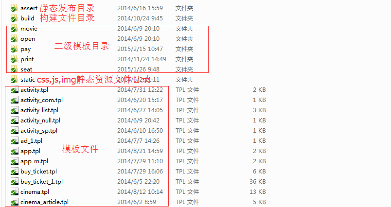

#前端文件结构 

针对前台页面实现前端分离，我们需要将所有静态文件统一置放在一个目录下且易于管理，如果增加静态文件`CDN`只需将该文件夹全部移植过去，而在css中对图片的相对路径将不受影响。

前端在整个项目主要负责三部分：

* smarty模板文件
* css,image,js等静态资源文件
* 活动页面模板及静态文件

## 目录结构

在爱星美官网中，静态资源文件及`smarty`模板统一放在根目录（网站）的`tpl`目录下。

**活动模板及文件请阅读第6章**